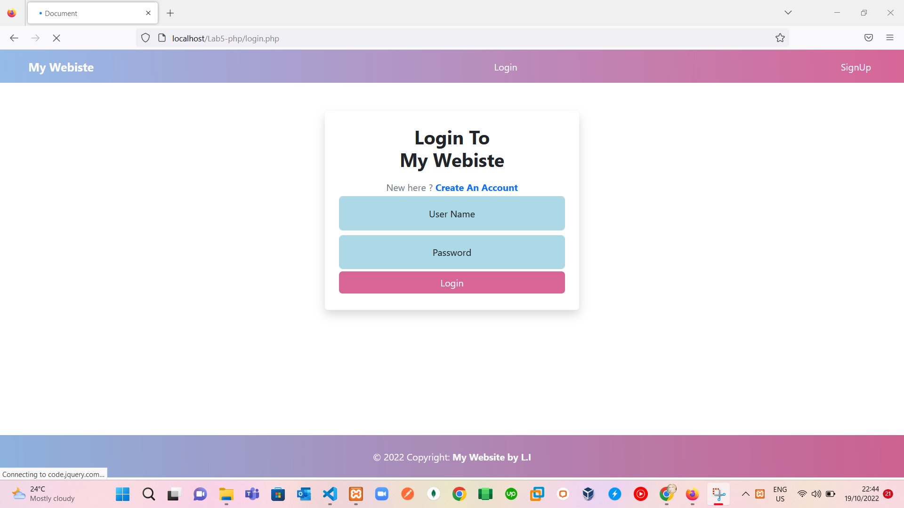

# Lab 5 :

> Requirement:
 1. connection to database with table username & password only.
 2. login and signUp pages with authentication.
 3. After user sign up, will redirect to login and after authentication. he will be redirect directly to landing page :).
 2. landing page after login :) with logout button :)

> Solve:
 1. Make the structure of pages.
  - `index.php` page as in:
    
  - `myblog.php` page as in:
    
  - `login.php` page as in:
    
  - `signUp.php` page as in:
    
 
 2. make file `dbconnection.php` to connect with database.
 3. finish the logic of website :).
  - if user enter website, see index page as in:
    
  - if user signUp page successfuly, he will redirect to login page :) .
  - if he login successfuly, he will redirect to Blog as in:
    
  - and he can now see blog page, he can logout :) as in:
    
  - after he logout, he will redirect to index and change header button 'see login and signup' as in:
    
  - To see Demo video as in: 
